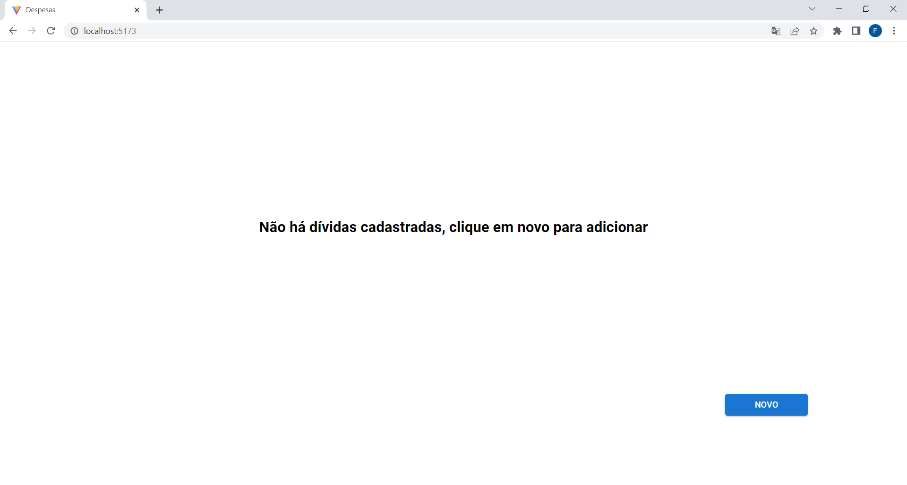
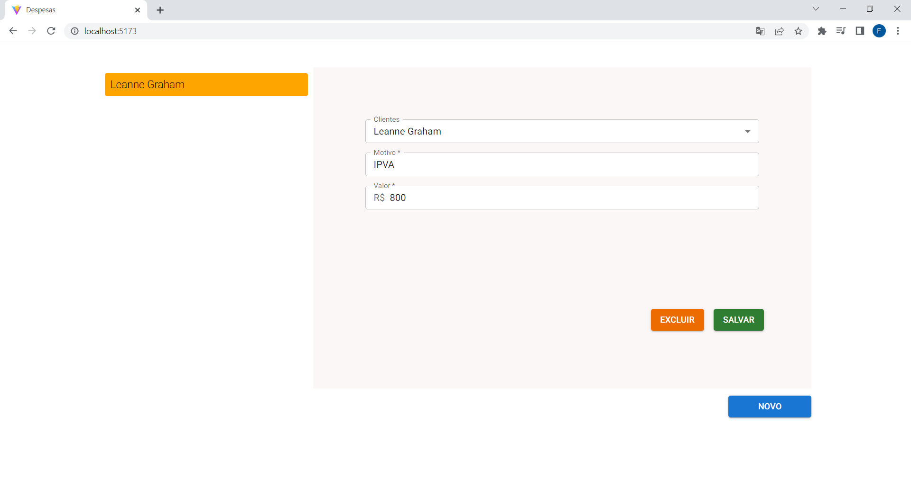
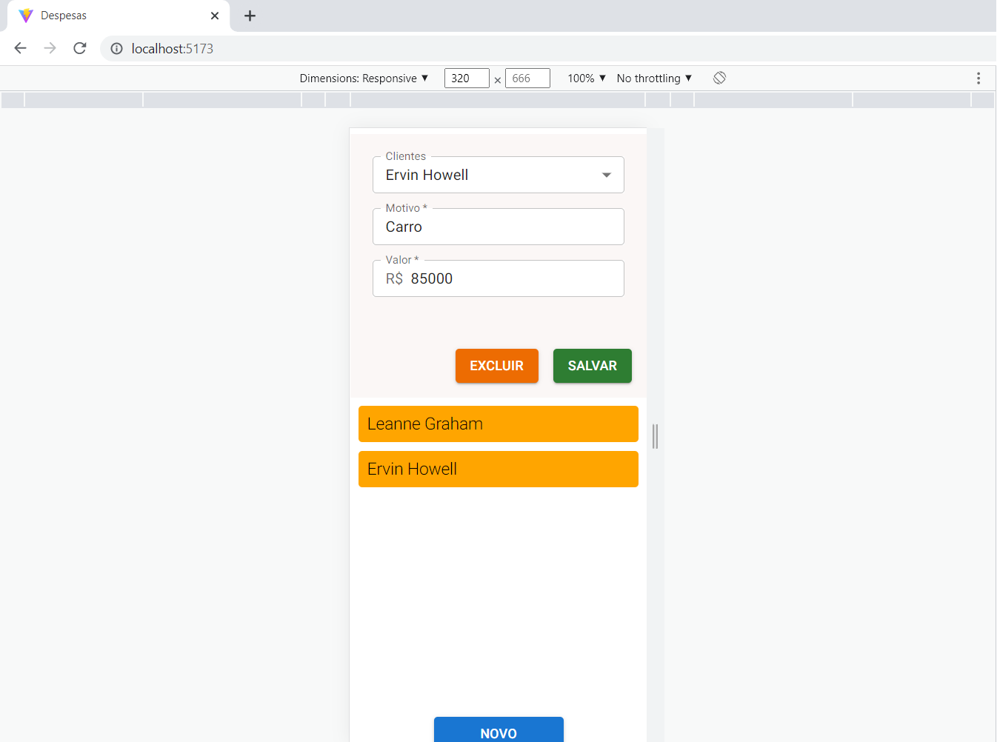

# PAGAMENTOS

## Descrição do Projeto
O projeto é o sistema de gerenciamento de devedores, fazendo a relação das dívidas com as pessoas existentes no JSONPlaceholder.

### Pré-requisitos

Antes de começar, você vai precisar ter instalado em sua máquina as seguintes ferramentas:
[Git](https://git-scm.com). 
Além disto é bom ter um editor para trabalhar com o código como [VSCode](https://code.visualstudio.com/)

### 🎲 Rodando a Projeto

```bash
# Clone este repositório
$ git clone <https://github.com/felippepg/pagamentos>

# Acesse a pasta do projeto no terminal/cmd
$ cd pagamentos

# Baixar todas as dependencias necessárias para rodar o projeto
$ yarn OU npm install (dependendo do seu gerenciador de pacotes)

# Para iniciar o projeto em modo de desenvolvedor 
$ yarn dev ou npm run dev
```


### :pushpin:	Home

<h1 align="center">
    
</h1>

### :pushpin:	Lista de Devedores

<h1 align="center">
    
</h1>

### :pushpin:	Lista de Devedores Mobile

<h1 align="center">
    
</h1>

## 🛠 Tecnologias

As seguintes tecnologias foram usadas na construção da API:

- [REACT.JS](https://pt-br.reactjs.org/)
- [TYPESCRIPT](https://www.typescriptlang.org/)
- [STYLED COMPONENTS](https://styled-components.com/)
- [MATERIAL-UI](https://mui.com/pt/)
